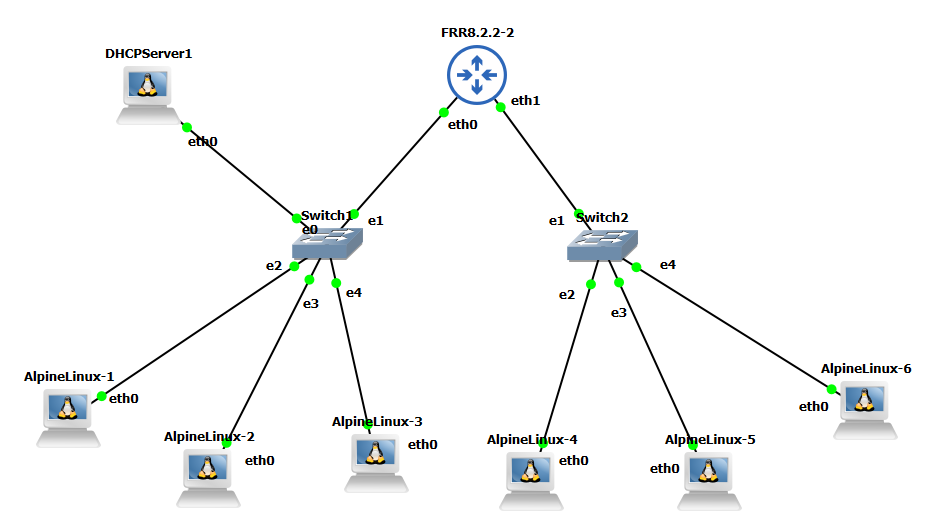
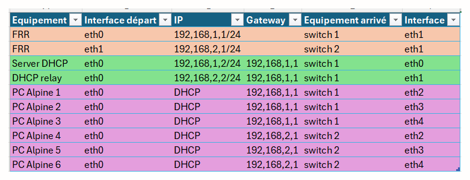

# DHCP relay

Mise en place de 2 LAN avec routage et DHCP relay

## Documentation

[Dnsmasq.conf](DHCP_relay/dnsmasq.conf.txt)
[FRRouter config](DHCP_relay/FRR_Interface_auto.txt)

## Screenshots

